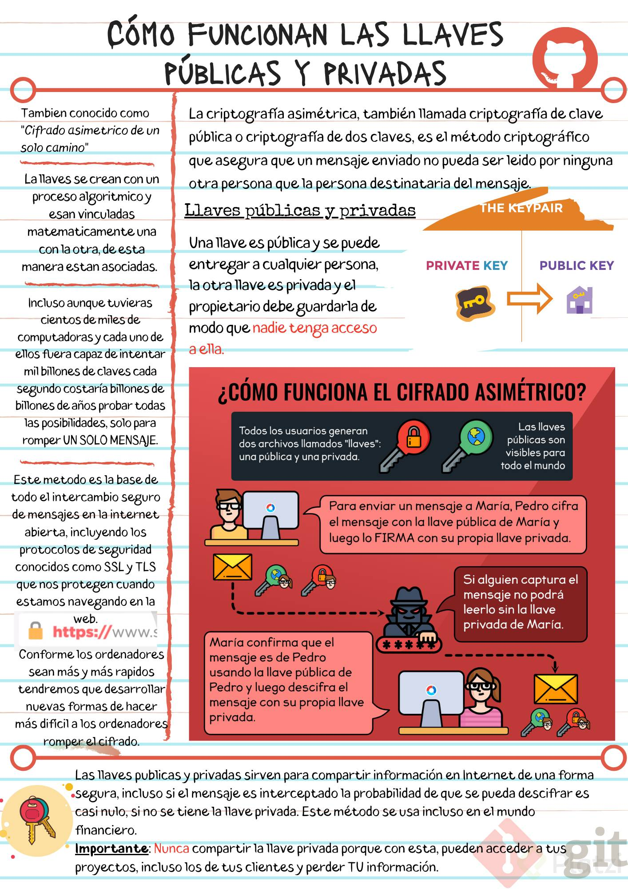
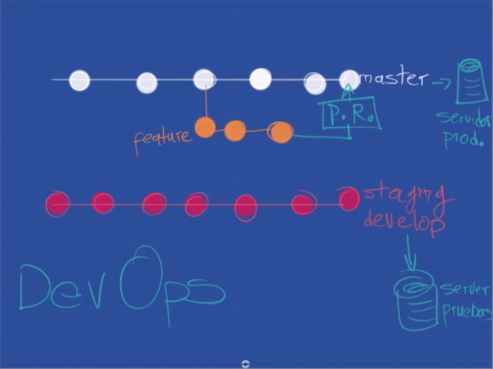

# Curso Profesional de Git y GitHub
Apuntes y repositorio de prueba del [Curso Profesional de Git y GitHub de Platzi](https://platzi.com/clases/git-github/)

- Proyecto guitarras Invie-sibles (2018)
- Actualización 2020

## - Comandos útiles

```bash
git show # Muestra todos los cambios histoicos hechos. Incluye información útil como que cambios se hicieron, cuando se hicieron y quien los hizo.

git log file.txt # Ver el historial de un archivo
```

## - ¿Qué es el staging y los repositorios? Ciclo básico de trabajo en Git

Al ejecutar *git init* se crea un área en la memoria RAM  llamada **staging** donde se almacenarán los cambios al principio, es una especie de *estado temporal*. 

En estado temporal se pueden hacer todos los cambios que se necesiten, de cierta forma esta es un área de preparación, en la que git estará al tanto de que archivos estamos modificando. Una vez se hace un commit se crea un hash (identificador) a las modificaciones para que cada uno de los miembros del proyecto pueda saber que se cambio.

Para mandar archivos al staging area se usa el comando:

```bash
git add file.py # El archivo pasa al staging area (tracked file) donde estará "esperando" hasta ser enviado al repositorio.

git rm --cached file.py # Quitar un archivo del staging area. --cached → Borrar el archivo de la memoria RAM 

git commit # Manda los archivos del staging area al repositorio.

```

Cuando los archivos aún no se han agregado al staging area con *git add*, son lo que se conoce como **untracked files**.

En ocasiones al trabajar en equipos puede ser necesario traer  un cambio que esta en el repositorio pero no esta en el sistema de archivo local en el que se esta trabajando. Para traer esos cambios se usa el comando:

```bash
git checkout
```

- ### Ramas (branch):

  Son una especie de líneas de tiempo en las que se puede dividir un proyecto para por ejemplo trabajar en funciones experimentales, características nuevas, o trabajar en paralelo.

  El crear una rama se crea una copia de determinada versión de la rama master para trabajar sobre ella. Una vez se termina de trabajar con esa rama nueva se hace un **merge ** para fusionar los cambios hechos en la rama nueva con la rama principal. Las ramas típicas en un proyecto de software son:

  - **master** (main en GitHub)
  - **development**
  - **hotfix**

- ### Mostrar configuración por defecto de Git

  ```bash
  git config --list
  git config --list --show-origin # Muestra donde están guardadas las configuraciones.
  ```

- ## Analizar cambios en los archivos con Git

  - Mostar los cambios hechos sobre un archivo:

    ```bash
    git show file.js
    ## @@ -1,5 +1,6 @@ → Indica la diferencia en bytes estre los cambios.
    ```

  - Ver diferencias entre commits

    ```bash
    git diff hashCommitViejo hastCommitNuevo # Se recomienda poner primero el commit más antiguo y luego el más reciente.
    ```

- ## Volver en el tiempo en el repositorio utilizando reset y checkout

  - **git reset**

    ```bash
    git reset --hard hashCommitVersionAnterior # --hard → Todo vuelve al estado anterior
    
    git reset --soft hashCommitVersionAnterior # --soft → Se regresa a la versión anterior pero se conservan los cambios que esten en el staging area
    ```

    Para ver las diferencias entre los untracked files el la unidad de almacenamiento del PC y el staging area en la memoria RAM se usa el comando:

    ```bash
    git diff # Asi sin más, sin hash ni nada
    ```

    Ver los cambios específicos que se hicieron en cada commit:

    ```bash
    git log --stat
    ```

  - **git checkout**

    Permite entre otras cosas traer archivos de regreso entre commits

    ```bash
    git checkout hashCommit file.js
    git checkout master file.js  # Regresa al archivo original de master
    ```

    Para mantener los cambios y conservar el,archivo viejo sólo hay que hacer un commit

    Si se van a renombrar archivos o a cambiarlos de ubicación en el repositorio lo recomendable es esar:

    ```bash
    git mv
    ```

    De lo contrario se puede perder el tracking y generar conflictos.

- ## git reset vs git rm

  - ### git rm

    Permite eliminar archivos de git sin eliminar su historial en el sistema de versiones. Por lo que para recuperar el archivo solo hay que *"viajar en el tiempo"*  y recuperar el archivo del último commit antes de borrarlo.

    ```bash
    git rm --cached # Elimina los archivos del área de Staging y del próximo commit pero los mantiene en el disco duro.
    
    git rm --force # Elimina los archivos de Git y del disco duro. Git siempre guarda todo, por lo que se acceder al registro de la existencia de los archivos, asi que se puede recuperar si es necesario (pero se deben usar comandos más avanzados).
    ```

  - **git reset**

    Permite *"volver en el tiempo"* pero de una forma diferente a git checkout que permite regresar, mirar, pasear y volver. **Git reset** se regresa al pasado sin la posibilidad de volver. Se borra y sobrescribe la historia. Por lo tanto es un comando muy peligroso que no se puede usar a la ligera.

    ```bash
    git reset --hard # Regresa y borra lo que este el el staging area
    
    git reset --soft # Mantiene los cambios que esten en ele staging area para que se pueda aplicar dichos cambios en un commit anterior
    
    git reset HEAD # Sirve para sacar archivos del staging area para que esos cambios no se envíen al último commit. Se puede deshacer agregando de nuevo los archivos con git add
    ```

-  ## Introducción a las ramas o branches de Git

  ```bash
  git commit -am "msj commit" # Perimite hacer el add y el commit en un sólo comando. Sólo funciona al modificar archivos que estaban en el staging area.
  ```

  - **Crear rama:** la nueva rama se crea a partir del HEAD de la rama actual. Con **git show** se ´puede ver hacia que rama esta apuntando el HEAD.

    ```bash
    git branch nombreRama # Crea una rama.
    git checkout nombreRama # Moverse a una rama
    ```

    Es importante que antes de pasar de una rama a otra se haga un commit para **evitar perder los cambios** que se hayan hecho.

- ## Fusión de ramas con Git merge

  Para hacer un merge primero hay que hacer un checkout a la rama que va a recibir los cambios, por ejemplo *master*. 

  Los **conflictos** ocurren cuando dos o más personas hacen cambios sobre la(s) misma(s) línea(s) de código.

  ```bash
  git checkout master # Moverse a la rama que va arecibir los cambios
  
  git merge nombreRama # Mezclar esa rama con la rama en la que estoy ahora. Esto crea con commit con el merge que se hizo
  
  git branch # Lista las ramas disponibles  y muestra en la rama en la que estoy posicionado
  
  ```

  **Merge** funciona en ambas direcciones. tanto para fusionar una rama con master como para fusionar a master con una rama diferente.

- ## Resolución de conflictos al hacer un merge

  Cuando hay un conflicto no se crea el commit del merge y por lo tanto la fusión no se completa. Git resalta con una sintaxis especial los conflictos.

  ```bash
  <<<<<<< HEAD
  	# Cambios actuales
  =======
  	# Cambios que vienen de la otra rama
  >>>>>>> otraRama
  ```

  Hay que solucionar esos conflictos y luego hacer un commit

- ## Uso de GitHub

  - **Proyectos:** son una especie de grupo de repositorios que se pueden tener dentro de una empresa/organización.

  - **Blame:** ver quén creo/modifico un archivo

  - **History:** es el equivalente al *git log*. Muestra el historial de un archivo

  - **Deltas:** son los cambios que se hacen a un archivo y se mandan al servidor. Al servidor no se le manda todo el archivo como tal si no los cambios que se hicieron sobre dicho archivo.

  - **Objects:** el repositorio comprimid para ser enviado a internet.

  - **origin/master:** el master del repositorio en GitHub

  - ### Añadir repositorio remoto:

    ```bash
    git remote add urlRespositorio
    git remote origin -v # Mostar los origins. Los repositorios remotos a los que se puede hacer fetch o push
    
    git pull origin master # Traer los cambios del repositorio remoto
    
    git pull origin master --allow-unrelated-histories # Permite fusionar historias de commits que no tienen ninguna relación entre si
    
    git push origin master # Mandar los cambios del repositorio local al remoto
    ```

- ## Cómo funcionan las llaves públicas y privadas

  

Se quiere transmitir un mensaje secreto a través de internet sin que se su contenido se vea comprometido. Para ello hay que:

-  Crear una llave pública y una privada. Estas llaves están vinculadas matemáticamente.
- Le mando una copia de la llave pública a la persona que me quiere mandar el mensaje.
- Usa persona usa la llave pública para encriptar el mensaje que me quiere mandar.
- La persona manda ese mensaje.
- Recibo el mensaje y uso mi llave privada para desencriptar el mensaje.

Durante el proceso de encriptado se usa un algoritmo que actualmente es tan fuerte que tomaría muchísimos años (muchos más de lo que dura la vida humana) descifrar el mensaje si no se tiene la llave privada.

- ## Configurar llaves SSH en local

  Las llaves SSH no se crean por repositorio o proyecto. Se crean por persona o computador.

  - Se crea en el entorno local una llave pública y una privada.

  - Se manda la llave pública a GitHub.

  - Esto permite establecer una conexión **ssh** con GitHub.

  - En la primera conexión GitHub sabe que se mandas una llave pública creada en local y manda cifrada con la propia llave pública creada en local una llave pública.

  - A partir de ahora hay una conexión de SSH 100% cifrada.

    A la llave privada creada en local se le puede añadir una contraseña para hacerla aún más segura. También es recomendable cifrar  el disco duro, en el caso de Windows eso se hace con BitLocker(sólo para Windows Professional).

    Para **generar la llave SSH** se usan los siguientes comandos:

    ```bash
    ssh-keygen -t rsa -b 4096 -C "user@email.com" # ssh-keygen → genera la llave SSH. -t rsa → Especifica el algortitmo para crear las llaves SSH. -b 4096 → Especifica la complejidad de la llave -C email al que se va a asociar la llave
    
    eval $(ssh-agent -s) # Evaluar que SSH este corriendo
    
    ssh-add rutaLlaveSSH # Anadir la llave al sistema. No añadir a que tiene la extención .pub, esa es la pública
    ```

- ## Conexión a GitHub con SSH

  - Ir GitHub

  - Click en settings > SSH and GPG Keys > New SSH key

  - Darle un nombre a la llave

  - Pegar el contenido de la llave pública

  - Confirmar el proceso poniendo la contraseña de GitHub

    

  Para conectarse al repositorio de GitHub usando SSH:

  - Ir al repositorio deseado.

  - Click en Clone or download > Use SSH

  - Copiar la URL

    - Agregar o reemplazar, según sea el caso, esa URL con **git remote**. Si se quiere reemplazar la URL  se usa el comando:

      ```bash
      git remote set-url origin git@github.com:Usuraio/Repositorio.git # origin → el nombre del repositorio remoto. Origin es un estándar en la industria
      ```

      Es una **buena práctica** hacer  un pull al repositorio remoto antes de hacer cambios en el repositorio local y antes de mandar cambios nuevos en un push.

- ## Tags y versiones en GitHub

  ```bash
  git log --all # Mostra TODOS los commits hechos en el proyecto
  git log --all --graph # Mostar con gráfico con el historial y comportamiento de las ramas creadas en el proyecto.
  git log --all --graph --decorate --oneline # Muestra el gráfico de una maenera más corta y concisa.
  
  # Este log se muestra en orden cronologico ascendente (se lee de abajo hacia arriba)
  ```

  Crear un alias de un comando

  ```bash
  alias nombrelias="comando"
  ```

  Crear un **tag**

  - usar *git log* con algunos de los parámetros del punto anterior para obtener el hash del commit al que se le va a agregar un tag.

  - Añadir el tag al commit con ese hash:

    ```bash
    git tag -a v0.1 -m "mensaje, como si fuera un commit" hashCommit # -a → Indica que se quiere añadir un tag
    
    git tag # Lista todos los tags creados
    
    git show-ref --tags # Mostar a que commit esta asociado cada tag
    ```

  - Mandar tags a GitHub:

    ```bash
    git push origin --tags
    ```

  Borrar un tag:

  ```bash
  git tag -d nombreTag # -d → Indica que se quiere borrar ese tag
  ```

  Luego de borrar un tag hay que volver a hacer un push con los tags al repositorio remoto para que se vean los cambios en GitHub. No obstante hay que hacerlo de una forma especial para que GitHub no siga tomado ese tag como un release.

  ````bash
  git push origin :refs/tags/nombreTag
  ````

- ## Manejo de ramas en GitHub

  Algunos comandos útiles al trabajar con ramas:

  ````bash
  git show-branch # Muestra cuáles son las ramas que exiten y cuál ha sido su historia.
  
  git show-brach --all # Muestra lo mismo que el comando anterior pero con un poco más de datos
  
  gitk # Muestra la historia del proyecto de en una interfaz gráfica
  ````

  Mandar una rama del repositorio local al repositorio remoto en GitHub:

  - Hacer un pull al repositorio remoto *(Buena práctica)*

  - Moverse con *git checkout* a la rama deseada

  - Hacer push de esa rama

    ````bash
    git push origin nombreRama
    ````

- ## Configurar múltiples colaboradores en un repositorio de GitHub

  Los repositorios **públicos** se pueden clonar sin ningún proble y sin autenticarse en git.

  Añadir a un usuario como contribuidor de un repositorio:

  - Ir a los settings del **repositorio**
  - Click en *Collaborators*
  - Escribir el nombre de usuario de la persona que se quiere añadir como contribuidor.

- ## Flujo de trabajo profesional: Haciendo merge de ramas de desarrollo a master

  Las **buenas prácticas** dicen que no se deberían agregar archivos binarios al repositorio, estos deberían estar aparte y ser ignorados. Esto se debe a que los archivos binarios al no ser código se van a mandar completos cada vez  que  se hagan cambios y mientras más binarios tenga el repositorio más pesado va a  ser.

- ## Flujo de trabajo profesional con Pull request

  En entornos de trabajo profesional es poco común que se pueda hacer merge directamente a master. Lo normal es que la rama master este bloqueada  y se tenga que hacer un pull request para hacer un merge con master. Esto se debe a que master es la rama que se manda a producción.

  Algo que también es común en entornos profesionales es tener un entorno de pruebas que sea lo más similar posible al entorno de producción. Por ejemplo si se tiene un website llamado *hyperblog.com* lo normal es que ese entorno de desarrollo se encuentre en un subdominio como *test.hyperblog.com*. A ese enrorno se le conoce como **develop server** o **staging server**.

  Staging/develop seria una rama de desarrollo conectada al servidor de Staging. Dicha rama siempre deber estar actualizada con master. Cada desarrollador trabaja en su entorno local y manda sus cambios a la rama de desarrollo pero no hace merge directamente con esa rama sino que hace un **pull request** que es un estado intermedio antes de hacer el merge en el que otro miembro del equipo revisa los cambios hechos y si toda esta bien permite el merge con la rama de desarrollo. Una vez se prueban los cambios en el servidor de staging se hace otro pull request para agregar esos cambios a master.

  Los **pull request** no son una característica de Git, son una característica de GitHub.

  

- ## Utilizando Pull Request en GitHub

  **Milestones:** cuando se asigna un pull request a un milestone, significa que se logró un objetivo que se tenia y que dicho Pull request  lo representa.

  **Projects:** son formas de agrupar repositorios dentro de GitHub.

- ## Creando un Fork, contribuyendo a un repositorio

  Un **fork** es una copia del estado actual de un repositorio. Dicha copia se almacena en la cuenta de GitHub de la persona que hizo el fork. Esta es una característica de GitHub no de Git.

  Cómo contribuir en un proyecto Open Source:

  - Hacer un **fork** al proyecto en cuestión.

  - Clonar el repositorio en el PC.

  - Hacer los cambios en local con los que se quiere contribuir al proyecto.

  - Hacer un commit y un push al fork del repositorio.

  - En GitHub abrir un Pull Request en el fork del repositorio. GitHub abre una interfaz en la que se pueden comparar las diferentes ramas entre los dos repositorios, revisar los cambios que se hicieron, etc.

  - Se crea un pull request en el que detalla con una descripción cuáles son los cambios que se hicieron.

    GitHub avisa cuando un repositorio se adelanta al fork, y permite comparar las diferencias y hacer un pull request para traer los cambios. Otra opción es traerse los cambios desde la terminal, creando una rama que traiga los cambios del repositorio original.

    ````bash
    git remote upstream urlRepositorioOriginal # upstream → es el nombre que se va a dar al repositorio remoto, dicho nombre es una convención
    
    git pull upstream master # Trae los cambios de upstream a la rama master. Luego se hace un commit con dichos cambios
    
    git push origin master # Manda los cambios al fork en GitHub
    ````

- ## Ignorar archivos en el repositorio con .gitignore

  - Crear un archivo llamado **.gitignore** es la raíz del proyecto

  - Dentro de .gitignore se ponen los nombres de archivo o directorios que no se deben agregar a git

    ````bash
    *.jpg # Igonorar todos los archivos con extención .jpg
    
    /content/themes # Ignorar la carpeta themes que esta dentro de content
    
    /content/themes/casper #  No ignorar la carpeta casper dentro de content/themes
    ````

- ## README.md es una buena práctica

  El **readme** es un archivo hecho hecho en *markdown* que es un lenguaje de marcado que esta en un punto intermedio entre HTML y un texto plano. Permite dar formato de forma sencilla a un texto. Además también admite fragmentos de HTML en su interior (ver el readme de VueJs)

- ## Publicar un website con GitHub pages

  - Crear un repositorio público con el siguiente nombre: *tunombredeusuario.github.io*

  - Agregarle a ese repositorio un index.html

  - Configurar en GitHub que rama se va a usar para hacer deploy del sitio Web

- ## Git rebase: reorganizando el trabajo realizado

  Consiste en toma runa rama completa y pegarla de regreso en la rama master. Es una **muy mala práctica** hacer esto enviarlo al repositorio remoto, si esto se hace debe ser sólo en local. Usa git rebase con precaución y procurando preguntar antes a los compañeros de equipo.

  ### Cómo hacer un rebase

  - Posicionarse en la rama que se quiere pegar a master.

  - Ejecutar:

    ````bash
    git rebase master # Pega los cambios de la rama actual a master
    ````

  - Regresar a la rama master

  - Hacer un rebase desde master a la rama que se quiere pegar

    ````bash
    git rebase experimento
    ````

- ## Git Stash: guardar cambios en memoria y recuperarlos después

  **Git Stash** permite guardar cambios en lugar temporal en caso de que dichos cambios aún no estén listos para ser agregados en un commit

  ````bash
  git stash # Mandar cambios al stash
  git stash list # Listar los stash guardados. WIP → Signifca Work In Progress
  
  git stash pop # Traer de regreso los cambios guardados en el stash. Trae el último estado del stashed y lo inserta en el staging area
  git stash drop # Eliminar el último stash
  git stash drop stash@{<stash_id>} # Borrar un stash especifico
  git stash clear # Borrar todos los stash
  
  git stash branch nombreRama # Manda los cambios del stash a una rama
  git stash branch nombreRama stash@{<stash_id>} # Crear una rama y aplicarle los cambios de un stash especifico
  ````

  Git stash es útil no sólo para guardar cambios que aún no están listos sino también para hacer pequeños experimentos que no ameritan una rama o un commit y después volver rápidamente al estado anterior

  También se puede poner un mensaje para identificar un stash al listarlos

  ````bash
  git stash save "Mensaje"
  ````

  Git stash es agnóstico de la rama en la que se encuentra, git stash recupera los cambios que se hicieron en el lugar en que se invoca.

  ### Otros comandos útiles de Git stash:

  - Aplicar los cambios de un stash específico y eliminar ese stash

    ````bash
    git stash pop stash@{<stash_id>} # <stash_id> → Se obtine con git stash list
    ````

  - Recuperar los cambios de un stash especifico:

    ````bash
    git stash apply stash@{<stash_id}
    ````

    ### Consideraciones:

    - El cambio más reciente (al crear un stash) **SIEMPRE** recibe el valor 0 y los que estaban antes aumentan su valor.
    - Al crear un stash tomará los archivos que han sido modificados y   eliminados. Para que tome un archivo creado es necesario agregarlo al   Staging Area con git add [nombre_archivo] con la intención de que git   tenga un seguimiento de ese archivo, o también utilizando el comando git stash -u (que guardará en el stash los archivos que no estén en el  staging).
    - Al aplicar un stash este no se elimina, es buena práctica eliminarlo.